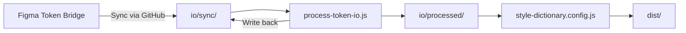

# Design Token System

## Overview

The design token system is a single source of truth for design decisions that power the Wylie Dog design system. It provides a consistent way to manage and use design tokens across all platforms and products.

## Directory Structure

```bash
packages/tokens/
├── dist/                    # Built assets (CSS, JS, etc.)
├── io/                      # Token I/O pipeline
│   ├── sync/                # Bi-directional Figma sync (version controlled)
│   └── processed/           # Normalized token files (build artifacts)
├── scripts/                 # Build and processing scripts
│   ├── process-token-io.js  # Main token processor
│   ├── validate-tokens.js   # Token validation
│   └── audit-tokens.js      # Token usage auditing
└── style-dictionary.config.js  # Style Dictionary configuration
```

## Token Types

1. **Primitive Tokens**
   - Basic design values (colors, spacing, typography, etc.)
   - Synced to `io/sync/primitive.json` via Token Bridge plugin
   - Processed into `io/processed/primitive.json`

2. **Semantic Tokens**
   - Contextual tokens that reference primitives
   - Light/Dark mode variants via `valuesByMode`
   - Synced to `io/sync/semantic.json`
   - Processed into `io/processed/semantic-light.json` and `semantic-dark.json`

3. **Component Tokens**
   - Component-specific tokens
   - Synced to `io/sync/components.json`
   - Processed into `io/processed/component-light.json` and `component-dark.json`

## Build Process

### 1. Token Processing Pipeline



### 2. Build Commands

```bash
# Install dependencies
pnpm install

# Process tokens and build all outputs
pnpm build

# Process tokens only
pnpm process-io

# Clean build artifacts (preserves io/sync/)
pnpm clean

# Validate token structure and references
pnpm test:tokens

# Audit token usage across components
pnpm audit
```

### 3. Output Files

- `dist/tokens.css`: Combined light + dark mode tokens
- `dist/semantic-light.css`: Light mode tokens only
- `dist/semantic-dark.css`: Dark mode tokens only
- `dist/hierarchical.js`: Hierarchical JS tokens
- `dist/index.js`: Flat JS tokens

## Using Tokens

### In CSS/SCSS

```css
/* Using CSS Custom Properties */
.button {
  background-color: var(--color-primary-500);
  padding: var(--spacing-4);
  border-radius: var(--radius-md);
}

/* Dark mode support */
@media (prefers-color-scheme: dark) {
  .button {
    background-color: var(--color-primary-400);
  }
}
```

### In JavaScript/TypeScript

```javascript
import { color } from "@wyliedog/tokens/hierarchical";

// Accessing tokens
const primaryColor = color.primary[500]; // oklch(0.623 0.188 259.81)
```

## Adding New Tokens

1. **Primitive Tokens**: Add to `io/input/primitive.json`
2. **Semantic Tokens**: Add to `io/input/semantic.json`
3. **Component Tokens**: Add to `io/input/components.json`

## Best Practices

1. **Naming Conventions**
   - Use kebab-case for token names
   - Group related tokens with prefixes (e.g., `--color-`, `--spacing-`)
   - Be consistent with scale values (50, 100, 200, etc.)

2. **Token Organization**
   - Keep primitive tokens in `primitive.json`
   - Use semantic tokens for theming and modes
   - Component-specific tokens should be in `components.json`

3. **Version Control**
   - Commit token changes with clear messages
   - Include Figma version or reference in commit messages

## Troubleshooting

### Common Issues

1. **Missing Token Exports**
   - Run `pnpm clean && pnpm build` to rebuild all tokens
   - Check `io/processed/` for processed token files

2. **Incorrect Token Values**
   - Verify the token exists in the input files
   - Check for typos in token names
   - Ensure the token is being processed in `process-token-io.js`

3. **Build Failures**
   - Check for JSON syntax errors in input files
   - Verify all required dependencies are installed
   - Check Node.js version (requires v16+)

## Future Improvements

- [ ] Add automated testing for token generation
- [ ] Implement visual regression testing
- [ ] Add token documentation generator
- [ ] Create a token viewer/explorer
- [ ] Add support for more output formats (iOS, Android, etc.)
